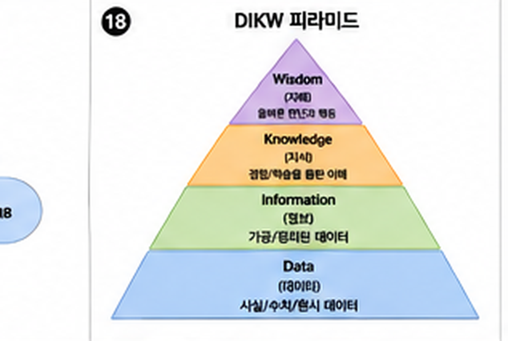

> **대상:** EC2·S3 같은 클라우드 리소스를 콘솔에서 클릭해서 만들어봤고, 배포 자동화(CI/CD)까지는 해본 사람
> **목적:** 인프라를 코드로 관리하는 이유와 Terraform·쿠버네티스의 기본 개념, 언제 필요한지를 정리합니다

---

# 0. 시작 전에 — 자주 나오는 용어

EC2·S3 같은 클라우드 리소스를 콘솔에서 만들어본 경험은 이미 있다고 가정합니다. 여기서는 이 문서에서 새로 나오는 용어만 정리합니다.

| 용어 | 쉬운 설명 |
| --- | --- |
| IaC (Infrastructure as Code) | 서버·네트워크 같은 인프라 설정을 코드(텍스트 파일)로 작성해서 관리하는 방식 |
| Terraform | 대표적인 IaC 도구. 원하는 인프라 상태를 코드로 선언하면 그 상태로 맞춰줌 |
| Provider | Terraform이 AWS, GCP 같은 특정 클라우드와 통신하기 위해 설치하는 연결 모듈 |
| State 파일 | Terraform이 "지금 인프라가 어떤 상태인지" 기록해두는 파일 |
| Remote State | State 파일을 로컬이 아니라 팀이 함께 접근할 수 있는 원격 저장소에 두는 방식 |
| 컨테이너(Container) | 애플리케이션과 실행에 필요한 환경을 통째로 묶어, 어디서든 같게 실행되게 하는 단위(대표적으로 Docker) |
| 쿠버네티스(Kubernetes) | 여러 컨테이너를 여러 서버에 걸쳐 자동으로 배포·복구·확장해주는 오케스트레이션 도구 |
| Pod | 쿠버네티스에서 컨테이너를 담는 가장 작은 배포 단위 |
| Deployment | "이 Pod를 몇 개 유지할지" 선언해두면 Pod가 죽어도 자동으로 다시 띄워주는 쿠버네티스 개념 |
| Service | 여러 Pod 앞에 붙는 고정 접속 주소. 요청을 여러 Pod에 나눠줌(로드밸런싱) |
| 롤링 업데이트(Rolling Update) | 서버를 몇 대씩 순차적으로 새 버전으로 교체하는 배포 방식 |
| 블루/그린 배포(Blue/Green) | 새 버전을 완전히 별도로 띄운 뒤 트래픽을 한 번에 전환하는 배포 방식 |
| 카나리 배포(Canary) | 새 버전에 트래픽의 일부만 먼저 흘려보내 문제를 조기에 확인하는 배포 방식 |

---

# 1. 왜 콘솔 클릭이 언젠가 한계에 부딪히는가

```text
문제 1: "이 서버 설정 그대로 하나 더 만들어줘" → 사람이 다시 클릭, 하나라도 다르면 장애 원인
문제 2: "지난달에 보안 그룹 누가 왜 바꿨지?" → 콘솔에는 이력이 잘 안 남음
문제 3: "새 팀원이 개발 환경을 처음부터 다시 클릭해서 만들어야 함" → 하루 종일 걸림
```

**IaC(Infrastructure as Code)**는 인프라 설정을 코드(텍스트 파일)로 작성하고, 그 코드를 실행해서 인프라를 만드는 방식입니다. 코드이므로 Git으로 버전 관리·리뷰·롤백이 가능해집니다.

**기본 상식**: 서버 한두 대짜리 사이드 프로젝트에 IaC는 오히려 배우는 비용이 더 클 수 있습니다. "환경이 여러 개(개발/스테이징/운영)"이거나 "같은 구성을 반복해서 만들어야" 할 때 진짜 효과가 나타납니다.

---

# 2. Terraform 기본 개념

Terraform은 원하는 인프라의 **최종 상태**를 코드로 선언하면, 지금 상태와 비교해서 필요한 변경만 적용해주는 도구입니다.

```hcl
# main.tf
resource "aws_instance" "web" {
  ami           = "ami-0abcdef1234567890"
  instance_type = "t3.micro"

  tags = {
    Name = "study-web-server"
  }
}
```

```bash
terraform init    # 필요한 provider(AWS 등) 설치
terraform plan     # 지금 상태와 코드의 차이를 미리 보여줌 — 실제 변경 X
terraform apply    # plan에서 확인한 변경을 실제로 적용
```

**`plan`이 핵심입니다.** 실제로 뭘 만들고, 뭘 바꾸고, 뭘 지울지 미리 사람이 눈으로 확인한 다음에 적용합니다. "실수로 운영 DB가 삭제될 뻔했는데 plan에서 발견했다"는 경험담이 실무에 정말 많습니다.

## State 파일

Terraform은 지금 인프라 상태를 `terraform.tfstate` 파일에 기록해서 추적합니다. 이 파일이 팀원마다 다르면 서로 다른 상태를 기준으로 계산해서 충돌이 납니다.

**기본 상식**: 여러 명이 함께 쓴다면 State 파일을 로컬이 아니라 S3 같은 원격 저장소에 두고(Remote State), 동시에 두 명이 apply하지 못하도록 잠금(Lock)까지 설정합니다.

---

# 3. 쿠버네티스(Kubernetes) 기본 개념

컨테이너(Docker)로 만든 애플리케이션을 여러 서버에 걸쳐 자동으로 배포·복구·확장해주는 오케스트레이션 도구입니다.

| 개념 | 쉬운 설명 |
| --- | --- |
| Pod | 컨테이너를 담는 가장 작은 배포 단위 |
| Deployment | "이 Pod를 몇 개 유지해라"를 선언 — Pod가 죽으면 자동으로 다시 띄움 |
| Service | 여러 Pod 앞에 붙는 고정된 접속 주소(로드밸런싱 포함) |
| Ingress | 외부 트래픽을 어떤 Service로 보낼지 정하는 규칙(도메인·경로 기준) |
| Namespace | 같은 클러스터 안에서 리소스를 논리적으로 구분하는 공간 |

```yaml
# deployment.yaml (일부)
apiVersion: apps/v1
kind: Deployment
spec:
  replicas: 3          # 항상 3개의 Pod를 유지
  template:
    spec:
      containers:
        - name: api
          image: my-registry/api:1.4.0
```

<svg viewBox="0 0 700 300" xmlns="http://www.w3.org/2000/svg" role="img" aria-label="쿠버네티스 Pod Deployment Service Ingress 관계도" style="max-width:100%;height:auto;font-family:inherit">
  <style>
    .k8-user{fill:var(--callout-concept-bg);stroke:var(--accent);stroke-width:1.5}
    .k8-ing{fill:var(--accent-weak);stroke:var(--accent);stroke-width:1.8}
    .k8-svc{fill:var(--callout-tip-bg);stroke:var(--callout-tip-border);stroke-width:1.5}
    .k8-dep{fill:var(--surface-soft-2);stroke:var(--border-strong);stroke-width:1.5;stroke-dasharray:5 3}
    .k8-pod{fill:var(--card-bg);stroke:var(--border-strong);stroke-width:1.5}
    .k8-text{fill:var(--text);font-size:12px;text-anchor:middle}
    .k8-sub{fill:var(--text-secondary);font-size:10px;text-anchor:middle}
    .k8-arrow{stroke:var(--text-faint);stroke-width:1.5;fill:none;marker-end:url(#k8Arrow)}
  </style>
  <defs>
    <marker id="k8Arrow" viewBox="0 0 10 10" refX="8" refY="5" markerWidth="6" markerHeight="6" orient="auto-start-reverse"><path d="M0,0 L10,5 L0,10 z" fill="var(--text-faint)"/></marker>
  </defs>

  <rect x="290" y="6" width="120" height="36" rx="8" class="k8-user"/><text x="350" y="29" class="k8-text">외부 트래픽</text>
  <line x1="350" y1="42" x2="350" y2="65" class="k8-arrow"/>

  <rect x="250" y="65" width="200" height="40" rx="8" class="k8-ing"/><text x="350" y="90" class="k8-text" style="font-weight:700">Ingress</text>
  <text x="350" y="118" class="k8-sub">도메인·경로 기준 라우팅 규칙</text>
  <line x1="350" y1="105" x2="350" y2="135" class="k8-arrow"/>

  <rect x="250" y="135" width="200" height="40" rx="8" class="k8-svc"/><text x="350" y="160" class="k8-text" style="font-weight:700">Service</text>
  <text x="350" y="188" class="k8-sub">고정 접속 주소 + 로드밸런싱</text>

  <line x1="300" y1="175" x2="180" y2="215" class="k8-arrow"/>
  <line x1="350" y1="175" x2="350" y2="215" class="k8-arrow"/>
  <line x1="400" y1="175" x2="520" y2="215" class="k8-arrow"/>

  <rect x="90" y="215" width="440" height="75" rx="10" class="k8-dep"/>
  <text x="110" y="232" class="k8-sub" style="text-anchor:start;font-weight:600">Deployment (replicas: 3 — 항상 3개 유지)</text>
  <rect x="115" y="240" width="110" height="40" rx="6" class="k8-pod"/><text x="170" y="264" class="k8-text">Pod</text>
  <rect x="295" y="240" width="110" height="40" rx="6" class="k8-pod"/><text x="350" y="264" class="k8-text">Pod</text>
  <rect x="475" y="240" width="110" height="40" rx="6" class="k8-pod"/><text x="530" y="264" class="k8-text">Pod</text>
</svg>

`replicas: 3`으로 선언해두면, Pod 하나가 죽어도 쿠버네티스가 자동으로 새 Pod를 띄워 3개를 유지합니다. 사람이 "서버 다시 켜야 하나?" 고민할 필요가 없어집니다.

**기본 상식**: 쿠버네티스는 강력하지만 배우고 운영하는 비용 자체가 만만치 않습니다. 서비스가 하나둘일 때는 관리형 배포 서비스(예: AWS ECS, App Runner)로도 충분하고, 여러 서비스를 표준화된 방식으로 굴려야 할 규모가 됐을 때 검토합니다.

---

# 4. 배포 전략

한 번에 전체 서버를 새 버전으로 바꾸면, 새 버전에 문제가 있을 때 전체 서비스가 동시에 멈춥니다.

| 전략 | 방식 | 특징 |
| --- | --- | --- |
| 롤링 업데이트 | 서버를 몇 대씩 순차적으로 교체 | 가장 흔함, 배포 중에도 서비스 유지 |
| 블루/그린 | 새 버전(그린) 전체를 미리 띄우고, 트래픽을 한 번에 전환 | 문제 생기면 즉시 이전 버전(블루)으로 되돌림 |
| 카나리 | 새 버전에 트래픽 일부(예: 5%)만 먼저 흘려보냄 | 문제를 소수 사용자에게만 노출한 채 확인 가능 |

**기본 상식**: 배포 전략을 고르는 기준은 "실패했을 때 되돌리는 속도"와 "실패의 영향 범위"입니다. 되돌리기가 빠르고 영향 범위를 최소화할수록 안전하지만, 그만큼 인프라 비용과 복잡도는 올라갑니다.

---

# 5. 언제 쓰고 언제 쓰지 않는가

| 상황 | 권장 |
| --- | --- |
| 서버 1~2대, 환경도 1개(운영만) | 콘솔 관리로 충분, IaC 학습 비용이 더 클 수 있음 |
| 개발/스테이징/운영 환경을 반복해서 똑같이 구성해야 함 | Terraform 도입 검토 |
| 배포 단위(서비스)가 1~3개 | 관리형 컨테이너 서비스(ECS 등)로 충분 |
| 배포 단위가 많고, 팀마다 독립적으로 배포·확장해야 함 | 쿠버네티스 검토 |

---

# 6. 자주 하는 실수

- `terraform apply`를 `plan` 없이 바로 실행해서 의도치 않은 리소스 삭제
- State 파일을 로컬에만 두고 팀원과 공유하지 않아 상태 불일치
- 필요 이상으로 큰 인스턴스를 기본값으로 계속 사용(비용 낭비)
- 서비스 규모에 비해 과도하게 이른 쿠버네티스 도입으로 운영 부담만 커짐
- 배포 실패 시 롤백 절차를 미리 연습해보지 않음

---

# 7. 실전 체크리스트

- [ ] 인프라 변경을 콘솔이 아니라 코드(PR)로 리뷰할 수 있는가
- [ ] `terraform plan` 결과를 사람이 확인한 뒤에만 apply하는가
- [ ] State 파일이 원격에 안전하게 저장·잠금되는가
- [ ] 배포 전략이 실패 시 빠르게 되돌릴 수 있는 구조인가
- [ ] 지금 규모에 쿠버네티스가 정말 필요한지, 더 간단한 대안은 없는지 검토했는가

---

# 8. 클라우드 비용 최적화(FinOps)

```text
- Right Sizing: 실제 사용률(CPU/메모리)을 모니터링해 과도하게 큰 인스턴스를 줄임
- 예약 인스턴스/Savings Plan: 꾸준히 쓰는 리소스는 온디맨드보다 약정 할인으로 절감
- 스팟 인스턴스: 중단돼도 괜찮은 배치 작업은 훨씬 저렴한 스팟 인스턴스 활용
- 사용하지 않는 리소스 정리: 테스트 후 방치된 볼륨·IP·스냅샷이 비용을 계속 발생시킴
- 태그 기반 비용 추적: 리소스에 팀/프로젝트 태그를 붙여 어디서 비용이 발생하는지 가시화
```

**기본 상식**: 클라우드 비용은 "쓴 만큼 낸다"는 유연함이 장점이지만, 반대로 무심코 켜둔 리소스가 계속 청구되는 함정이기도 합니다. 정기적으로 비용 대시보드를 확인하는 습관이 실무에서 큰 차이를 만듭니다.

---

# 9. 멀티 클라우드·재해 복구 아키텍처

## 리전(Region) 이중화

```text
Primary Region(서울) 장애 시
→ DR(Disaster Recovery) Region(도쿄 등)으로 트래픽 전환
```

| 전략 | RTO(복구 시간) | 비용 |
| --- | --- | --- |
| 백업만 보관(Backup & Restore) | 길다(수 시간) | 가장 저렴 |
| Pilot Light(최소 구성만 대기) | 중간 | 중간 |
| Warm Standby(축소된 형태로 상시 운영) | 짧다 | 높음 |
| Active-Active(두 리전 모두 상시 운영) | 거의 없음 | 가장 비쌈 |



**기본 상식**: 모든 서비스가 Active-Active 수준의 재해 복구를 갖출 필요는 없습니다. 서비스 중단이 실제로 얼마나 큰 손해로 이어지는지(RTO/RPO 요구사항)를 먼저 정하고, 그에 맞는 비용 수준의 전략을 선택합니다. 스타트업 초기 단계에서는 정기 백업만으로 충분한 경우가 많습니다.

---

# 10. Terraform 모듈로 재사용성 높이기

같은 코드를 환경마다(개발/스테이징/운영) 복사-붙여넣기 하면 한쪽만 고치고 다른 쪽을 놓치는 실수가 반복됩니다. **모듈(Module)**로 공통 구조를 묶어 재사용합니다.

```hcl
# modules/web-server/main.tf — 재사용 가능한 모듈 정의
variable "instance_type" {}
variable "environment" {}

resource "aws_instance" "web" {
  ami           = "ami-0abcdef1234567890"
  instance_type = var.instance_type
  tags = { Name = "${var.environment}-web" }
}
```

```hcl
# environments/prod/main.tf — 모듈 호출
module "web_prod" {
  source        = "../../modules/web-server"
  instance_type = "t3.medium"
  environment   = "prod"
}

module "web_staging" {
  source        = "../../modules/web-server"
  instance_type = "t3.micro"
  environment   = "staging"
}
```

**기본 상식**: 모듈화의 기준은 "이 구성을 2번 이상 반복해서 쓰는가"입니다. 한 번만 쓰는 리소스까지 억지로 모듈로 쪼개면 오히려 코드를 따라가기 어려워집니다.

## 워크스페이스로 환경 분리하기

```bash
terraform workspace new staging
terraform workspace new prod
terraform workspace select prod
terraform apply   # 현재 선택된 workspace의 state만 영향받음
```

**주의**: workspace는 같은 코드를 여러 state로 나누는 가벼운 방법이지만, 운영·개발처럼 리소스 구성 자체가 크게 다르면 워크스페이스보다 디렉터리(환경별 폴더)로 완전히 분리하는 편이 실수를 줄입니다.

---

# 11. GitOps로 배포 자동화하기

인프라·쿠버네티스 설정 변경을 Git 저장소를 기준(Single Source of Truth)으로 자동 반영하는 방식입니다.

```text
전통적 배포: 사람이 kubectl apply를 직접 실행 → 누가 언제 뭘 바꿨는지 클러스터 안에만 남음
GitOps: Git에 설정 변경 PR 병합 → 자동화 도구(ArgoCD 등)가 감지해 클러스터에 자동 반영
```

```text
1. 개발자가 deployment.yaml의 image 태그를 새 버전으로 수정하는 PR을 올림
2. 리뷰·머지되면 ArgoCD가 Git 저장소와 클러스터 상태 차이를 감지
3. 자동으로 클러스터에 반영(Sync) → 클러스터 상태 = Git 저장소 상태
4. 문제 생기면 Git revert만으로 이전 상태로 롤백
```

**기본 상식**: GitOps의 핵심 이점은 "클러스터의 현재 상태를 Git 커밋 이력만 보고 그대로 재구성할 수 있다"는 것입니다. 장애 시 "지금 클러스터에 뭐가 떠있는지" 콘솔을 뒤질 필요 없이 Git 로그가 곧 답입니다.

---

# 12. 시크릿 관리와 오토스케일링

## 시크릿을 코드에 직접 넣지 않기

```hcl
# 잘못된 예 — 비밀번호가 코드에 그대로 노출, Git 이력에 영구히 남음
resource "aws_db_instance" "main" {
  password = "SuperSecret123!"
}
```

```hcl
# 올바른 예 — 별도 시크릿 관리 서비스에서 값을 가져옴
data "aws_secretsmanager_secret_version" "db" {
  secret_id = "prod/db/password"
}

resource "aws_db_instance" "main" {
  password = data.aws_secretsmanager_secret_version.db.secret_string
}
```

**기본 상식**: 시크릿 값 자체는 코드 저장소가 아니라 AWS Secrets Manager, HashiCorp Vault 같은 전용 서비스에 두고, 코드에는 "어디서 가져올지"만 선언합니다. `.tfstate` 파일에도 값이 평문으로 남을 수 있으므로 State 파일 접근 권한도 함께 관리합니다.

## 오토스케일링(Autoscaling)

| 방식 | 기준 | 예시 |
| --- | --- | --- |
| 수평적 확장(HPA) | CPU/메모리 사용률, 커스텀 지표 | 사용률 70% 초과 시 Pod 2개 → 5개 |
| 수직적 확장(VPA) | 컨테이너 하나의 리소스 할당량 자체를 조정 | 메모리 부족이 반복되면 할당량 자동 증가 |
| 클러스터 오토스케일러 | Pod를 못 띄울 만큼 노드가 부족하면 노드 자체를 추가 | 트래픽 급증 시 서버 대수 자동 증설 |

```yaml
apiVersion: autoscaling/v2
kind: HorizontalPodAutoscaler
spec:
  minReplicas: 2
  maxReplicas: 10
  metrics:
    - type: Resource
      resource:
        name: cpu
        target:
          type: Utilization
          averageUtilization: 70
```

**실무 팁**: 오토스케일링을 도입하면 "트래픽이 늘면 알아서 늘어난다"고 안심하기 쉽지만, 새 Pod가 뜨는 데도 시간이 걸립니다(콜드 스타트). 급격한 트래픽 스파이크(이벤트 오픈 등)가 예상된다면 오토스케일링만 믿지 말고 미리 최소 Pod 수를 늘려두는 예방적 스케일링을 함께 씁니다.

---

# 13. 컨테이너 이미지 보안

- 베이스 이미지는 `latest` 태그 대신 **버전을 고정**해서 사용 — 예기치 않은 변경 방지
- 이미지 빌드 후 취약점 스캐너(Trivy 등)로 알려진 CVE(취약점) 점검을 CI에 포함
- 컨테이너를 root 권한이 아닌 일반 사용자로 실행하도록 Dockerfile에 명시
- 불필요한 패키지·빌드 도구는 최종 이미지에서 제거(멀티스테이지 빌드 활용)

```dockerfile
# 멀티스테이지 빌드 — 빌드 도구는 최종 이미지에 남지 않음
FROM node:20 AS build
WORKDIR /app
COPY . .
RUN npm ci && npm run build

FROM node:20-slim
WORKDIR /app
COPY --from=build /app/dist ./dist
USER node          # root가 아닌 일반 사용자로 실행
CMD ["node", "dist/server.js"]
```

**기본 상식**: 컨테이너가 격리돼 있다고 해서 이미지 자체의 취약점까지 안전한 것은 아닙니다. 베이스 이미지에 알려진 취약점이 있으면 그 컨테이너를 통해 공격 표면이 그대로 넓어집니다.
