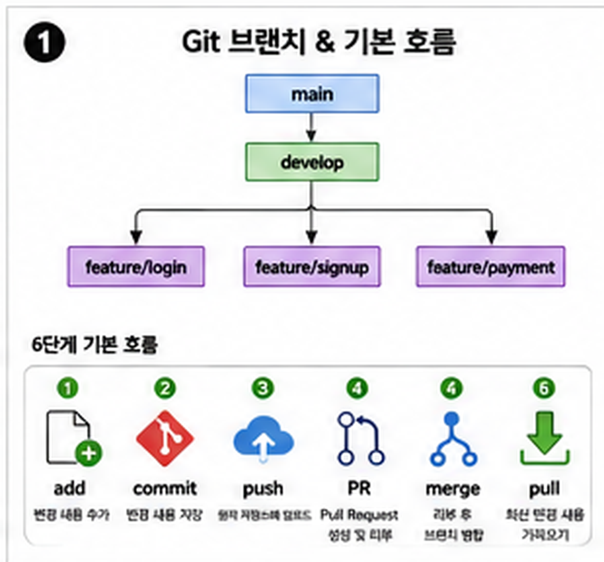

> **대상:** `git`이라는 단어를 오늘 처음 들어본 사람  
> **목적:** 팀 프로젝트에 바로 투입돼도 되는 딱 그만큼만 — branch, commit, push, PR, merge, pull이 각각 뭘 하는 건지 5분 안에 감 잡기  
> **사용법:** 이 문서는 끝까지 읽는 데 5분이면 충분합니다. 다 읽고 나서 "더 알고 싶다" 싶으면 아래 [Git·GitHub 기초 가이드](Git·GitHub%20기초%20가이드.html)로 넘어가세요. 지금은 용어와 명령어를 몰라도 됩니다 — 이 순서만 알면 됩니다.
---

# 0. 왜 이 문서부터 봐야 하나

Git을 처음 배울 때 가장 흔한 실수는 명령어부터 외우려고 하는 것입니다. 처음 보는 용어와 명령어가 한꺼번에 쏟아지면 머리만 아프고, 정작 알아야 할 큰 그림은 하나도 안 남습니다.

먼저 알아야 할 건 딱 하나, **"내 코드가 어떤 경로를 거쳐서 팀 코드가 되는가"** 뿐입니다. 이 경로 하나만 머릿속에 그려지면 충분합니다. 세세한 명령어와 옵션은 필요할 때 찾아보거나, AI 코딩 도구에게 시켜도 됩니다 — 이 문서는 그 경로 하나만 알려줍니다.

# 1. branch 세 줄 정리

| branch | 쉬운 말 | 비유 |
| --- | --- | --- |
| `main` | 사이트에 실제로 배포되는, 진짜 최최종 코드 | **제출본** |
| `develop` | main이랑 거의 같은 코드인데, main에 합치기 전에 오류를 먼저 확인하는 용도 | **팀 공동 작업본** |
| `feature/*` | 나 혼자 지금 작업 중인 코드 | **내 개인 작업본** |

초보자가 가장 많이 하는 실수가 이겁니다 — **`main`에 바로 코드를 넣는 것.** 절대 안 됩니다. 항상 나만의 `feature` branch에서 작업하고, `develop`을 거쳐서, 검증된 코드만 `main`으로 갑니다.

# 2. 전체 흐름 한 장으로 보기

1. README와 issue(내가 만들어야 할 기능)를 확인한다
2. 내 `feature` branch를 만들어서 기능을 만든다 (코드 작성)
3. 다 됐으면 `develop`에 올린다 — `add` → `commit` → `push`
4. GitHub에 "이 코드 좀 봐주세요"라는 설명서를 올린다 — **PR(Pull Request)**
5. 팀원이 오류 없는지 확인하면 `main`(또는 `develop`) 코드와 합쳐진다 — **merge**
6. 팀원들도 지금까지 쌓인 최신 코드를 자기 컴퓨터로 받아온다 — **pull**

이 여섯 줄이 이 문서의 전부입니다. 나머지는 전부 이 흐름을 실제 명령어로 옮기는 방법일 뿐입니다.




# 3. 내 컴퓨터 코드를 GitHub에 올리기

`add` → `commit` → `push`, 이 세 단계가 "내 컴퓨터에 있는 코드를 GitHub로 옮기는 것"입니다. 이 과정에서 보통 새 branch도 함께 만들어집니다.

```bash
git add .
git commit -m "챗봇 UI 구현"
git push origin feature/chatbot
```

- `add .` — 지금까지 수정한 내용을 전부 담는다
- `commit -m "..."` — 무엇을 고쳤는지 한 줄로 남기고 저장한다 (중간 저장 포인트)
- `push origin feature/chatbot` — 그 저장 내용을 GitHub의 `feature/chatbot` branch로 올린다

# 4. 내 코드 + 팀 코드가 합쳐지는 과정

1. 코드를 올릴 때 보통 새 branch가 생긴다 (위 3번의 `feature/chatbot`처럼)
2. GitHub에서 **PR(Pull Request)**을 연다 — "제 코드를 공동 작업본에 합쳐주세요" 요청
3. 팀원이 오류 없는지 확인하고 **merge**한다 — 실제로 두 branch가 합쳐지는 순간
4. 다 합쳐진 branch는 삭제한다 (branch를 깔끔하게 유지하기 위해)
5. 이 코드와 관련 있는 팀원들은 GitHub에서 **pull**을 받는다 — 그래야 항상 최신 버전으로 작업할 수 있고 충돌도 줄어든다

# 5. 용어 한 줄 정리

| 용어 | 한 줄 정리 |
| --- | --- |
| main | 제출본 |
| develop | 팀 공동 작업본 |
| feature branch | 내 개인 작업본 |
| commit | 중간 저장 |
| push | GitHub에 업로드 |
| PR (Pull Request) | "제 코드 공동 작업본에 합쳐주세요" 요청 |
| merge | 실제로 합치기 |
| pull | 다른 사람이 합친 최신 코드 받아오기 |

# 6. 직접 실습해보기 — 5분 미니 실습

읽기만 하고 넘어가면 다음에 또 헷갈립니다. 아무 폴더에서나 아래를 그대로 따라 쳐보세요. 딱 5분이면 됩니다.

## 실습 1. 로컬 저장소 만들고 첫 커밋 해보기

```bash
mkdir git-practice
cd git-practice
git init
echo "hello git" > memo.txt
git add .
git commit -m "첫 커밋"
```

왜 이걸 하는지: `git init`은 이 폴더를 Git이 추적하는 저장소로 바꾸는 명령입니다. `add`와 `commit`을 직접 손으로 쳐봐야 "저장 = commit"이라는 감각이 생깁니다.

확인할 것: `git log --oneline`을 쳤을 때 방금 만든 "첫 커밋"이 보이는가?

## 실습 2. branch를 나눠서 작업해보기

```bash
git branch feature/practice
git switch feature/practice
echo "새 기능" >> memo.txt
git add .
git commit -m "기능 추가"
```

왜 이걸 하는지: `main`을 건드리지 않고 `feature/practice`라는 "내 개인 작업본"에서만 작업했다는 걸 눈으로 확인하기 위해서입니다.

## 실습 3. 다시 main으로 돌아와 merge 해보기

```bash
git switch main
git merge feature/practice
cat memo.txt
```

왜 이걸 하는지: PR에서 "merge" 버튼을 누르면 실제로는 이 명령이 실행되는 것과 같은 일이 일어납니다. 버튼 뒤에서 무슨 일이 벌어지는지 알면 팀 프로젝트에서 훨씬 덜 헷갈립니다.

<details class="quiz-answer">
<summary>정답 확인</summary>
<div class="quiz-answer-body">
<p>아래 항목을 스스로 체크해보세요. 전부 "예"라면 이 실습을 제대로 끝낸 것입니다.</p>
<ul>
<li>&#9744; <code>git log --oneline</code>에서 "첫 커밋" 메시지가 보인다</li>
<li>&#9744; <code>git switch feature/practice</code> 이후 만든 커밋은 <code>main</code>이 아니라 <code>feature/practice</code> branch에만 있다는 것을 <code>git log --oneline --all --graph</code>로 확인했다</li>
<li>&#9744; <code>git switch main</code> 후 <code>cat memo.txt</code>를 쳤을 때는 아직 "새 기능" 줄이 없다 (merge 전이므로)</li>
<li>&#9744; <code>git merge feature/practice</code> 이후 <code>cat memo.txt</code>에 "새 기능" 줄이 추가된 것을 확인했다</li>
<li>&#9744; branch, commit, merge가 각각 무엇을 하는 명령인지 다른 사람에게 한 문장씩 설명할 수 있다</li>
</ul>
</div>
</details>

# 7. 여기까지 왔다면

branch 명령어를 외우거나, 충돌(conflict)을 손으로 푸는 방법은 아직 몰라도 됩니다. 실제로 팀에서 막힐 때는 대부분 AI 코딩 도구에게 "branch 만들어서 커밋하고 push하고 PR까지 올려줘"라고 시키면 처리해 줍니다 — 사람은 PR을 읽고 오류가 없으면 merge 버튼만 누르면 됩니다.

지금 딱 이 정도만 알아도 팀 프로젝트에 투입될 수 있습니다. 실제 명령어를 손으로 치는 연습, 충돌 해결, 인증 설정까지 제대로 익히고 싶다면 → **[Git·GitHub 기초 가이드](Git·GitHub%20기초%20가이드.html)**로 이어서 보세요.
