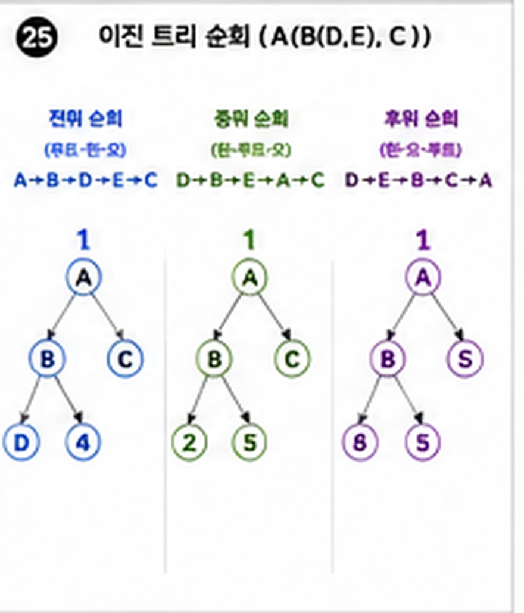
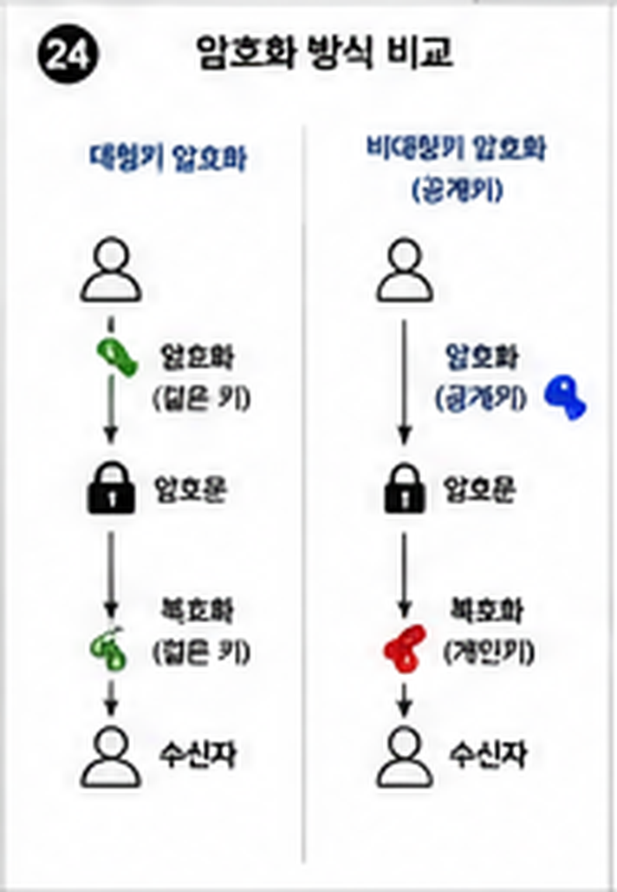

> **대상:** 클라우드·IaC 고급 가이드로 개념은 잡았고, AWS 자격증으로 공식 검증까지 받고 싶은 사람
> **목적:** AWS 공인 자격증 체계와 입문 단계인 Cloud Practitioner의 시험 범위를 정리합니다
> **사용법:** 시험 세부 정보(문항 수, 응시료, 합격 점수)는 자주 바뀌니 이 문서로 범위를 잡은 뒤 반드시 공식 사이트(AWS Certification, AWS Skill Builder)에서 최신 정보를 확인하세요.
> **📝 이 문서는 핵심 요약노트입니다.** 정식 교재를 대체하지 않습니다 — 감을 잡고 복습하는 용도로 쓰고, 실전 대비는 AWS 공식 학습 자료(Skill Builder)와 기출 유형 문제로 함께 준비하세요.

## 🎯 이 문서로 얼마나 커버되나

이 문서 내용을 완전히 이해하면 Cloud Practitioner 시험의 4개 도메인(Cloud Concepts / Security and Compliance / Cloud Technology and Services / Billing, Pricing, and Support) 핵심 개념은 대부분 다루게 됩니다. 다만 실제 시험은 서비스별 세부 기능·최신 업데이트된 서비스명·시나리오형 문제가 나올 수 있어 [AWS Skill Builder](https://skillbuilder.aws) 공식 연습 문제를 함께 풀어보길 권장합니다. 정확한 합격 기준(스케일드 스코어 커트라인)은 [AWS Certification 공식 사이트](https://aws.amazon.com/certification/)를 확인하세요.

**영역별 커버리지** (● = 이 문서가 다루는 상대적 비중, 절대 점수가 아닙니다)

| 영역 | 커버리지 |
| --- | --- |
| Cloud Concepts | ●●●○○ |
| Security and Compliance | ●●●●○ |
| Cloud Technology and Services | ●●●●● |
| Billing, Pricing, and Support | ●●●○○ |

---

# 0. 시작 전에 — 자주 나오는 용어

클라우드·IaC 고급 가이드에서 다룬 IaC·컨테이너·쿠버네티스 개념은 이미 안다고 가정합니다. 여기서는 AWS 자격증 범위에서 새로 나오는 용어만 정리합니다.

| 용어 | 쉬운 설명 |
| --- | --- |
| EC2 (Elastic Compute Cloud) | AWS에서 가상 서버를 빌려 쓰는 서비스 |
| S3 (Simple Storage Service) | 파일(이미지, 백업 등)을 저장해두는 AWS의 객체 스토리지 서비스 |
| IAM (Identity and Access Management) | AWS 리소스에 "누가 무엇을 할 수 있는지" 관리하는 서비스 |
| VPC (Virtual Private Cloud) | AWS 안에 격리된 나만의 가상 네트워크 공간을 만드는 서비스 |
| 리전(Region) / 가용 영역(AZ) | 리전은 AWS 데이터센터가 있는 지역(예: 서울), 가용 영역은 그 리전 안의 물리적으로 분리된 데이터센터 단위 |


| RDS (Relational Database Service) | AWS가 대신 운영·관리해주는 관계형 데이터베이스 서비스 |
| 종량제(Pay-as-you-go) | 사용한 만큼만 요금을 내는 클라우드의 기본 과금 방식 |
| Well-Architected Framework | AWS가 제시하는 "잘 설계된 클라우드 시스템"의 기준 프레임워크 |
| IAM 역할(Role) | 특정 상황에서 임시로 부여하는 권한 세트. 고정된 사용자가 아니라 누구든 그 역할을 맡으면 권한을 가짐 |
| CloudTrail | AWS 계정에서 누가 언제 무엇을 했는지 API 호출 이력을 기록하는 서비스 |
| CloudWatch | AWS 리소스의 성능 지표를 모니터링하고 이상 상황을 알리는 서비스 |
| ELB (로드밸런서) | 여러 서버에 트래픽을 나눠주는 AWS 서비스 |
| CloudFront (CDN) | 전 세계 엣지 로케이션에 콘텐츠를 캐싱해 빠르게 전달하는 서비스 |

---

# 1. 자격증 체계

AWS 자격증은 단계별로 나뉩니다. 처음이라면 Cloud Practitioner부터 시작하는 것이 일반적입니다.

| 단계 | 자격증 | 성격 |
| --- | --- | --- |
| 입문 | Cloud Practitioner | 클라우드 개념 전반의 기초 이해 (비개발자도 응시) |
| 어소시에이트 | Solutions Architect Associate 등 | 특정 역할(설계, 운영, 개발) 기준 실무 지식 |
| 프로페셔널/전문 | Solutions Architect Professional 등 | 어소시에이트보다 훨씬 깊은 실무·설계 역량 |

이 문서는 입문 단계인 **Cloud Practitioner** 기준으로 정리합니다.

---

# 2. 시험 구성 (Cloud Practitioner 기준)

시험은 4개 영역(도메인)으로 나뉩니다.

| 도메인 | 다루는 내용 |
| --- | --- |
| Cloud Concepts | 클라우드 컴퓨팅이 뭔지, 온프레미스와의 차이, 클라우드의 장점 |
| Security and Compliance | AWS와 사용자가 각자 책임지는 보안 범위(책임 공유 모델), IAM 기본 |
| Cloud Technology and Services | EC2·S3·RDS·VPC 등 핵심 서비스가 각각 뭘 하는지 |
| Billing, Pricing, and Support | 요금 체계, 예산 관리 도구, 지원 플랜 |

전 영역 객관식이며, 코드를 직접 작성하는 문제는 없습니다.

---

# 3. 핵심 개념

## 책임 공유 모델 (Shared Responsibility Model)

```text
AWS의 책임: 클라우드 자체의 보안 (데이터센터, 하드웨어, 네트워크 인프라)
사용자의 책임: 클라우드 안에서의 보안 (데이터 암호화, IAM 설정, OS 패치 등)
```



**기본 상식**: "클라우드에 올렸으니 AWS가 알아서 보안을 다 챙겨준다"는 흔한 오해입니다. 인프라 자체는 AWS 책임이지만, 그 위에서 무엇을 어떻게 설정하느냐(예: S3 버킷을 실수로 전체 공개로 설정)는 사용자 책임입니다. 시험에서 "이 상황은 누구 책임인가"를 자주 묻습니다.

## IAM 자세히 — 누가 무엇을 할 수 있는가

| 개념 | 의미 |
| --- | --- |
| 사용자(User) | 실제 사람 또는 애플리케이션 하나에 대응하는 개별 계정 |
| 그룹(Group) | 여러 사용자를 묶어 같은 권한을 한 번에 부여하는 단위 |
| 역할(Role) | 특정 상황(예: EC2가 S3에 접근)에 임시로 부여하는 권한 세트. 고정된 사용자가 아니라 "누구든 그 역할을 맡으면" 권한을 가짐 |
| 정책(Policy) | "이 사람/역할이 이 리소스에 이 행동을 할 수 있다"를 JSON으로 정의한 규칙 |

**기본 상식**: 루트 계정(AWS 가입 시 만들어지는 최고 권한 계정)은 평소 업무에 쓰지 않고, IAM 사용자를 따로 만들어 필요한 권한만 부여하는 것이 원칙입니다. 이 사이트의 보안 심화 가이드에서 다룬 최소 권한 원칙과 같은 개념입니다.

## 주요 보안·관리 서비스

| 서비스 | 역할 |
| --- | --- |
| CloudTrail | AWS 계정에서 "누가 언제 무엇을 했는지" 모든 API 호출 이력을 기록 |
| KMS (Key Management Service) | 데이터 암호화에 쓰는 키를 안전하게 생성·관리 |
| CloudWatch | 리소스의 성능 지표를 모니터링하고 이상 상황을 알림 |

## 고가용성 관련 서비스

| 서비스 | 역할 |
| --- | --- |
| ELB (Elastic Load Balancer) | 여러 EC2 인스턴스에 트래픽을 나눠주는 로드밸런서 |
| Auto Scaling | 트래픽에 따라 EC2 인스턴스 수를 자동으로 늘리고 줄임 |
| CloudFront | 전 세계 엣지 로케이션에 콘텐츠를 캐싱해 빠르게 전달하는 CDN |

이 사이트의 성능·스케일 고급 가이드에서 다룬 로드밸런서·오토스케일링·CDN 개념이 그대로 AWS 서비스 이름으로 등장하는 부분입니다.

## 핵심 서비스 한눈에

```text
컴퓨팅: EC2(가상 서버), Lambda(서버 없이 코드만 실행 — 서버리스)
스토리지: S3(파일 저장), EBS(EC2에 붙이는 디스크)
데이터베이스: RDS(관계형 DB 관리형 서비스)
네트워크: VPC(가상 네트워크), Route 53(DNS)
```

## Well-Architected Framework — 6개 기둥

```text
운영 우수성(Operational Excellence)
보안(Security)
안정성(Reliability)
성능 효율성(Performance Efficiency)
비용 최적화(Cost Optimization)
지속 가능성(Sustainability)
```

이 사이트의 성능·스케일 고급 가이드, 보안 심화 가이드에서 다룬 내용들이 이 프레임워크의 각 기둥과 실제로 맞닿아 있습니다.

## 요금 구조

```text
종량제(Pay-as-you-go): 쓴 만큼만 지불, 약정 없음
예약 인스턴스(Reserved): 1~3년 약정으로 할인
Savings Plans: 사용량 약정으로 유연하게 할인
```

**기본 상식**: 클라우드의 핵심 가치 중 하나는 "초기 투자 비용(CAPEX) 없이 사용한 만큼만 비용(OPEX)을 낸다"는 것입니다. 이 개념 자체가 시험에서 자주 출제됩니다.

## 지원 플랜(Support Plans)

| 플랜 | 대상 |
| --- | --- |
| Basic | 모든 계정에 기본 제공, 기술 지원 없음(문서·커뮤니티만) |
| Developer | 개발·테스트 단계, 업무 시간 중 이메일 지원 |
| Business | 운영 중인 서비스, 24/7 전화·채팅·이메일 지원 |
| Enterprise | 미션 크리티컬 서비스, 전담 지원 담당자(TAM) 배정 |

**기본 상식**: "장애가 나면 즉시 전화로 도움받고 싶다"처럼 사업 특성에 따라 플랜을 고릅니다. Basic은 무료지만 사람이 직접 응대하는 기술 지원은 없다는 점이 시험에서 자주 나옵니다.

---

# 4. 연습문제

> ⚠️ 아래 문제는 개념 이해를 돕기 위해 직접 만든 연습문제이며, 실제 AWS 공인 자격증 기출문제가 아닙니다.

**문제 1.** 책임 공유 모델에서 고객(사용자)의 책임에 해당하는 것은?
A) 데이터센터의 물리적 보안
B) 네트워크 인프라 장비 관리
C) S3 버킷의 접근 권한 설정
D) 하드웨어 장애 대응

**문제 2.** 사용한 만큼만 비용을 지불하며 약정이 없는 AWS의 기본 요금 방식은?
A) Reserved Instance
B) Savings Plans
C) Pay-as-you-go
D) Spot Instance

**문제 3.** 실제 사람이 아니라 "EC2가 S3에 접근해야 하는" 상황처럼 임시로 권한을 부여할 때 쓰는 IAM 개념은?
A) 사용자(User)
B) 그룹(Group)
C) 역할(Role)
D) 정책(Policy)

**문제 4.** 24/7 전화·채팅 지원이 필요한 운영 중인 서비스에 적합한 최소 지원 플랜은?
A) Basic
B) Developer
C) Business
D) 지원 플랜은 모두 동일하다

**정답**: 1번 C / 2번 C / 3번 C / 4번 C

---

# 5. 실전 연습문제 (정답 클릭 확인)

> ⚠️ 이 섹션의 문제는 실제 기출 유형·난이도를 참고해 새로 만든 오리지널 연습문제이며, 실제 기출문제 원문이 아닙니다. 정답을 클릭하면 해설이 펼쳐집니다.

**Q1.** AWS 책임 공유 모델(Shared Responsibility Model)에서 AWS의 책임 영역에 해당하는 것은?
A) 고객 데이터 암호화 설정
B) IAM 사용자 권한 관리
C) 글로벌 인프라(데이터센터, 하드웨어)의 물리적 보안
D) 애플리케이션 코드의 취약점 관리

<details class="quiz-answer">
<summary>정답 보기</summary>
<div class="quiz-answer-body">
<p><span class="quiz-correct">정답: C</span></p>
<p>AWS는 '클라우드 자체의 보안'(하드웨어, 데이터센터, 네트워크 인프라)을 책임지고, 고객은 '클라우드 내부의 보안'(데이터, 접근 권한, 애플리케이션)을 책임집니다.</p>
</div>
</details>

**Q2.** 정적 웹사이트 파일이나 백업 데이터를 저장하기에 가장 적합한 AWS 서비스는?
A) EC2
B) S3
C) VPC
D) IAM

<details class="quiz-answer">
<summary>정답 보기</summary>
<div class="quiz-answer-body">
<p><span class="quiz-correct">정답: B</span></p>
<p>S3(Simple Storage Service)는 객체 스토리지 서비스로 정적 파일·백업·로그 저장에 적합합니다. EC2는 컴퓨팅, VPC는 네트워크, IAM은 권한 관리 서비스입니다.</p>
</div>
</details>

**Q3.** 사용량 변화에 따라 EC2 인스턴스 수를 자동으로 늘리거나 줄여주는 서비스는?
A) Amazon RDS
B) Auto Scaling
C) AWS Lambda
D) Amazon CloudFront

<details class="quiz-answer">
<summary>정답 보기</summary>
<div class="quiz-answer-body">
<p><span class="quiz-correct">정답: B</span></p>
<p>Auto Scaling은 지표(CPU 사용률 등)에 따라 EC2 인스턴스 수를 자동으로 조정해 비용과 가용성을 함께 관리합니다.</p>
</div>
</details>

**Q4.** AWS의 요금 체계 중, 특정 기간을 약정하는 대신 필요한 만큼만 쓰고 그만큼만 지불하는 기본 원칙은?
A) Reserved Pricing
B) Pay-as-you-go
C) Fixed Pricing
D) Spot Pricing

<details class="quiz-answer">
<summary>정답 보기</summary>
<div class="quiz-answer-body">
<p><span class="quiz-correct">정답: B</span></p>
<p>Pay-as-you-go(종량제)는 AWS의 기본 요금 원칙으로 약정 없이 사용한 만큼만 비용을 지불합니다.</p>
</div>
</details>

**Q5.** 리전(Region)과 가용 영역(Availability Zone)의 관계를 가장 올바르게 설명한 것은?
A) 하나의 가용 영역 안에 여러 리전이 있다
B) 하나의 리전 안에 물리적으로 분리된 여러 가용 영역이 있다
C) 리전과 가용 영역은 동일한 개념이다
D) 가용 영역은 전 세계에 하나만 존재한다

<details class="quiz-answer">
<summary>정답 보기</summary>
<div class="quiz-answer-body">
<p><span class="quiz-correct">정답: B</span></p>
<p>리전은 지리적으로 분리된 지역(예: 서울)이며, 하나의 리전 안에는 서로 독립된 여러 개의 가용 영역(데이터센터 그룹)이 존재합니다.</p>
</div>
</details>

**Q6.** 실제 사람이 아니라 'EC2 인스턴스가 S3에 접근'하는 것처럼, 임시로 권한을 위임할 때 사용하는 IAM 요소는?
A) IAM 사용자(User)
B) IAM 그룹(Group)
C) IAM 역할(Role)
D) 루트 계정

<details class="quiz-answer">
<summary>정답 보기</summary>
<div class="quiz-answer-body">
<p><span class="quiz-correct">정답: C</span></p>
<p>IAM 역할은 사람이 아닌 AWS 리소스나 임시 접근이 필요한 주체에게 권한을 위임할 때 사용합니다.</p>
</div>
</details>

**Q7.** 여러 AWS 계정의 비용을 하나로 통합 관리하고 볼륨 할인 혜택을 받을 수 있게 해주는 서비스는?
A) AWS Budgets
B) AWS Organizations
C) Cost Explorer
D) Trusted Advisor

<details class="quiz-answer">
<summary>정답 보기</summary>
<div class="quiz-answer-body">
<p><span class="quiz-correct">정답: B</span></p>
<p>AWS Organizations는 여러 계정을 하나의 조직으로 묶어 통합 결제, 볼륨 할인, 정책 관리를 지원합니다.</p>
</div>
</details>

**Q8.** (OX) Amazon VPC는 AWS 클라우드 내에 논리적으로 격리된 자신만의 가상 네트워크를 구성할 수 있게 해준다.

<details class="quiz-answer">
<summary>정답 보기</summary>
<div class="quiz-answer-body">
<p><span class="quiz-correct">정답: O</span></p>
<p>VPC(Virtual Private Cloud)는 사용자가 IP 대역, 서브넷, 라우팅 등을 직접 설정할 수 있는 논리적으로 격리된 네트워크 공간입니다.</p>
</div>
</details>

**Q9.** (OX) 온디맨드(On-Demand) 인스턴스는 예약 인스턴스(Reserved Instance)보다 항상 저렴하다.

<details class="quiz-answer">
<summary>정답 보기</summary>
<div class="quiz-answer-body">
<p><span class="quiz-correct">정답: X</span></p>
<p>일반적으로 예약 인스턴스가 장기 약정을 조건으로 온디맨드보다 저렴합니다. 온디맨드는 약정이 없는 대신 단가가 더 높습니다.</p>
</div>
</details>

**Q10.** (단답형) AWS의 기술 지원과 모범 사례를 제공하며, 24시간 전화 상담이 필요한 프로덕션 서비스에는 최소 Business 이상이 권장되는 것은?

<details class="quiz-answer">
<summary>정답 보기</summary>
<div class="quiz-answer-body">
<p><span class="quiz-correct">정답: AWS Support Plan(지원 플랜)</span></p>
<p>AWS 지원 플랜은 Basic·Developer·Business·Enterprise로 나뉘며, 등급이 높을수록 응답 시간과 지원 범위가 넓어집니다.</p>
</div>
</details>

**Q11.** 사용자가 요청한 콘텐츠를 전 세계 여러 지역의 엣지 로케이션에 캐싱해 지연시간을 줄여주는 AWS의 CDN 서비스는?
A) Amazon Route 53
B) Amazon CloudFront
C) AWS Direct Connect
D) Amazon API Gateway

<details class="quiz-answer">
<summary>정답 보기</summary>
<div class="quiz-answer-body">
<p><span class="quiz-correct">정답: B</span></p>
<p>CloudFront는 전 세계 엣지 로케이션에 콘텐츠를 캐싱해 사용자와 가까운 곳에서 응답하는 CDN 서비스입니다. Route 53은 DNS, Direct Connect는 전용선 연결 서비스입니다.</p>
</div>
</details>

**Q12.** 서버를 직접 관리하지 않고 코드를 업로드하면 요청이 있을 때만 실행되고 사용한 만큼만 과금되는 컴퓨팅 서비스는?
A) Amazon EC2
B) AWS Lambda
C) Amazon Lightsail
D) AWS Elastic Beanstalk

<details class="quiz-answer">
<summary>정답 보기</summary>
<div class="quiz-answer-body">
<p><span class="quiz-correct">정답: B</span></p>
<p>Lambda는 서버 프로비저닝 없이 이벤트 발생 시에만 코드를 실행하는 서버리스 컴퓨팅 서비스로, 실행 시간과 호출 횟수만큼만 과금됩니다.</p>
</div>
</details>

**Q13.** AWS 계정의 루트 사용자 보안을 강화하기 위해 가장 먼저 적용해야 할 조치로 가장 적절한 것은?
A) 루트 사용자로 매일 로그인해 리소스를 직접 관리
B) 루트 사용자의 액세스 키를 발급해 애플리케이션에 사용
C) 다중 인증(MFA)을 활성화하고 평소에는 IAM 사용자를 사용
D) 루트 사용자 비밀번호를 팀 전체와 공유

<details class="quiz-answer">
<summary>정답 보기</summary>
<div class="quiz-answer-body">
<p><span class="quiz-correct">정답: C</span></p>
<p>루트 사용자는 계정의 모든 권한을 가지므로 MFA를 반드시 활성화하고, 평소 작업은 필요한 권한만 가진 IAM 사용자/역할로 수행하는 것이 모범 사례입니다.</p>
</div>
</details>

**Q14.** 관계형 데이터베이스를 관리형으로 손쉽게 운영할 수 있게 해주는 AWS 서비스는?
A) Amazon DynamoDB
B) Amazon RDS
C) Amazon Redshift
D) Amazon Neptune

<details class="quiz-answer">
<summary>정답 보기</summary>
<div class="quiz-answer-body">
<p><span class="quiz-correct">정답: B</span></p>
<p>RDS(Relational Database Service)는 MySQL, PostgreSQL 등 관계형 DB의 프로비저닝·백업·패치를 관리형으로 제공합니다. DynamoDB는 NoSQL, Redshift는 데이터 웨어하우스입니다.</p>
</div>
</details>

**Q15.** AWS에서 애플리케이션 상태와 성능 지표를 수집·모니터링하고 임계치 초과 시 알람을 보낼 수 있는 서비스는?
A) AWS CloudTrail
B) Amazon CloudWatch
C) AWS Config
D) AWS Trusted Advisor

<details class="quiz-answer">
<summary>정답 보기</summary>
<div class="quiz-answer-body">
<p><span class="quiz-correct">정답: B</span></p>
<p>CloudWatch는 지표 수집, 로그 관리, 알람 설정을 담당합니다. CloudTrail은 API 호출 이력을 기록하는 감사 로그 서비스로 목적이 다릅니다.</p>
</div>
</details>

**Q16.** (OX) 가용 영역(Availability Zone)은 하나의 데이터 센터만을 의미하며, 하나의 리전에는 항상 하나의 가용 영역만 존재한다.

<details class="quiz-answer">
<summary>정답 보기</summary>
<div class="quiz-answer-body">
<p><span class="quiz-correct">정답: X</span></p>
<p>하나의 리전에는 물리적으로 분리된 여러 개(보통 3개 이상)의 가용 영역이 존재하며, 이를 통해 하나의 가용 영역에 장애가 나도 다른 영역으로 서비스를 유지할 수 있습니다.</p>
</div>
</details>

**Q17.** (단답형) 계정 내 AWS API 호출 이력(누가, 언제, 무엇을 했는지)을 기록해 감사·보안 분석에 활용하는 서비스의 이름은?

<details class="quiz-answer">
<summary>정답 보기</summary>
<div class="quiz-answer-body">
<p><span class="quiz-correct">정답: AWS CloudTrail</span></p>
<p>CloudTrail은 계정에서 발생한 모든 API 호출을 기록해, 누가 언제 어떤 리소스에 어떤 작업을 했는지 추적할 수 있게 해주는 감사 로그 서비스입니다.</p>
</div>
</details>

---

# 6. 합격 꿀팁

- **AWS 공식 무료 학습 자료(AWS Skill Builder)를 가장 먼저 활용하세요.** Cloud Practitioner를 겨냥한 무료 강의·연습 문제가 공식으로 제공됩니다.
- 서비스 이름을 암기만 하지 말고, **무료 티어로 직접 콘솔에서 EC2 인스턴스 하나, S3 버킷 하나를 만들어보세요.** 눈으로 한 번 본 개념은 암기 카드보다 오래 남습니다.
- 서비스가 많아 헷갈리기 쉬우니, "이 서비스는 한 단어로 뭘 하는 서비스인가"를 카드처럼 정리해두세요(EC2=서버, S3=저장, RDS=DB, VPC=네트워크).
- 책임 공유 모델 문제가 자주 나옵니다. "이 상황은 AWS 책임인가 내 책임인가"를 판단하는 연습을 특히 많이 해두세요.

---

# 7. 자주 하는 실수

- "클라우드에 올리면 보안은 AWS가 다 책임진다"고 오해
- EC2와 Lambda(서버리스)의 차이를 모르고 아무 문제에나 EC2를 답으로 고름
- 리전과 가용 영역(AZ)을 같은 개념으로 혼동
- 요금제 종류(종량제/예약/Savings Plans)의 특징을 안 외우고 이름만 봄

---

# 8. 실전 체크리스트

- [ ] 책임 공유 모델에서 AWS 책임과 사용자 책임을 구분할 수 있는가
- [ ] EC2·S3·RDS·VPC가 각각 뭘 하는 서비스인지 한 줄로 설명할 수 있는가
- [ ] IAM의 사용자·그룹·역할·정책 차이를 설명할 수 있는가
- [ ] 리전과 가용 영역의 차이를 아는가
- [ ] ELB·Auto Scaling·CloudFront가 각각 어떤 문제를 해결하는지 아는가
- [ ] 4가지 지원 플랜의 차이를 아는가
- [ ] Well-Architected Framework 6개 기둥을 나열할 수 있는가
- [ ] 최신 시험 범위·응시료를 공식 사이트에서 확인했는가

---

# 9. 진짜 기출문제는 여기서

AWS 공인 자격증은 실제 기출문제 원문을 공개하지 않습니다. 대신 [AWS Skill Builder 공식 무료 연습문제](https://skillbuilder.aws)에서 Cloud Practitioner 대비 공식 연습 문제를 풀어볼 수 있고, 자격증 시험 안내는 [AWS Certification 공식 사이트](https://aws.amazon.com/certification/)에서 확인하세요. 이 문서는 시험 범위와 개념 정리만 제공합니다.

---

# 10. AI로 나만의 모의고사 만들기

아래 프롬프트를 ChatGPT, Claude 등 AI 챗봇에 그대로 복사해서 붙여넣으면 이 문서 범위에 맞는 추가 연습문제를 새로 만들어줍니다. 실제 기출문제가 아닌 창작 문제이므로, 감 잡기·복습용으로 활용하고 공식 연습 문제는 9번 섹션의 AWS Skill Builder 링크를 이용하세요. 실제 AWS 자격증 시험은 영어로도 응시할 수 있으므로, 영어 버전도 함께 요청하는 프롬프트를 넣어뒀습니다.

```text
You are an AWS Certified Cloud Practitioner (CLF-C02) exam question writer.
Create a practice exam with the following conditions:
- Domains: Cloud Concepts, Security and Compliance, Cloud Technology and Services, Billing/Pricing/Support
- Question type: 10 multiple-choice questions (4 options each), matching the real exam style
- Difficulty: similar to the real AWS Cloud Practitioner exam
- Provide the correct answer and a short explanation right after each question
- Clearly state at the end that these are newly created original questions, not real exam questions
- Distribute questions evenly, but put extra weight on "Cloud Technology and Services"
```

---

# 11. 자주 헷갈리는 서비스 비교

| 헷갈리는 짝 | 구분 |
| --- | --- |
| S3 vs EBS vs EFS | S3(객체 스토리지, 인터넷으로 접근), EBS(EC2 전용 블록 스토리지, 한 인스턴스에 연결), EFS(여러 EC2가 동시에 공유하는 파일 스토리지) |
| Security Group vs NACL | Security Group은 인스턴스 단위 방화벽(허용 규칙만, Stateful), NACL은 서브넷 단위 방화벽(허용+거부 규칙, Stateless) |
| RDS vs DynamoDB | RDS는 관계형(스키마 고정, JOIN 가능), DynamoDB는 NoSQL(스키마 유연, 대규모 트래픽에 수평 확장 유리) |
| IAM 사용자 vs 역할(Role) | 사용자는 특정 사람/애플리케이션에 고정된 자격 증명, 역할은 필요할 때 임시로 위임받아 쓰는 권한(자격 증명 없이 위임) |
| CloudFront vs Route 53 | CloudFront는 콘텐츠를 엣지에 캐싱하는 CDN, Route 53은 DNS(도메인 이름을 IP로 변환) 서비스 |
| Auto Scaling vs ELB | Auto Scaling은 트래픽에 따라 서버 대수를 조절, ELB는 여러 서버로 트래픽을 분산 — 둘은 함께 쓰이는 짝 |

---

# 12. 시험 직전 최종 점검 리스트

- [ ] Region(지역)과 Availability Zone(가용 영역)의 관계를 그림으로 설명할 수 있는가
- [ ] 온디맨드/예약/스팟 인스턴스의 가격·중단 특성 차이를 아는가
- [ ] S3의 스토리지 클래스(Standard, IA, Glacier 등)를 비용·접근 빈도 기준으로 구분할 수 있는가
- [ ] VPC의 퍼블릭/프라이빗 서브넷 개념과 인터넷 게이트웨이 역할을 아는가
- [ ] 책임 공유 모델(Shared Responsibility Model)에서 AWS와 고객의 책임 경계를 설명할 수 있는가
- [ ] 프리 티어(Free Tier)의 기본 개념과 청구 알림(Billing Alarm) 설정 목적을 아는가

---

# 13. 요금 계산·IAM 정책·아키텍처 시나리오 심화

> Cloud Practitioner 시험은 실제 계산기를 쓰진 않지만, "이 상황에서 어느 쪽이 더 저렴한가/적합한가"를 단계별로 추론하는 시나리오 문제가 자주 나옵니다. 아래는 개념 이해를 위한 오리지널 창작 예제입니다.

## 12.1 EC2 요금제 비교 시나리오

**예제 문제**: 아래 세 가지 워크로드에 각각 가장 적합한 EC2 구매 옵션을 골라라.

```text
① 3년간 안정적으로 운영될 사내 ERP 서버 (중단되면 업무 마비)
② 몇 시간짜리 대용량 로그 배치 분석 작업, 중간에 중단돼도 재시도하면 되는 작업
③ 명절 트래픽 급증에 대비해 필요할 때만 짧게 켜는 이벤트 페이지 서버
```

**풀이 과정**

1. ①은 장기간·중단 불가 워크로드 → 1~3년 약정으로 대폭 할인받는 **예약 인스턴스(Reserved Instance)** 또는 Savings Plans가 적합
2. ②는 중단돼도 무방하고 비용에 민감한 배치 작업 → 유휴 용량을 최대 90%까지 할인받는 대신 언제든 회수될 수 있는 **스팟 인스턴스(Spot Instance)**가 적합
3. ③은 예측 불가능하고 짧은 기간만 필요 → 약정 없이 쓴 만큼 내는 **온디맨드 인스턴스(On-Demand)**가 적합

**정답**: ① 예약 인스턴스, ② 스팟 인스턴스, ③ 온디맨드 인스턴스

**참고 — EC2 구매 옵션 비용/특성 비교**

| 옵션 | 비용 수준 | 중단 위험 | 적합한 워크로드 |
| --- | --- | --- | --- |
| 온디맨드(On-Demand) | 기준(가장 비쌈) | 없음(직접 종료 전까지 유지) | 예측 불가능한 단기 워크로드 |
| 예약(Reserved) | 온디맨드 대비 최대 ~72% 할인 | 없음 | 장기간 예측 가능한 안정적 워크로드 |
| 스팟(Spot) | 온디맨드 대비 최대 ~90% 할인 | 있음(AWS가 회수 가능) | 중단 허용 가능한 배치·분산 처리 |
| Savings Plans | 예약과 유사한 수준 할인 | 없음 | 인스턴스 유형이 유동적인 장기 워크로드 |

## 12.2 EC2 vs S3 비용 비교 시나리오

**예제 문제**: 정적 이미지 파일 100만 장(변경 없음, 조회만 발생)을 서비스해야 한다. EC2에 웹 서버를 띄워 파일을 서빙하는 방식과, S3에 저장하고 정적 웹 호스팅으로 서빙하는 방식 중 무엇이 더 적합한가?

**풀이 과정**

1. EC2 방식: 인스턴스를 항상 켜둬야 하고(가동 시간 요금 발생), 트래픽이 몰리면 오토스케일링·로드밸런서까지 추가로 필요해 운영 부담과 비용이 커짐.
2. S3 방식: 서버 관리 없이 저장 용량 + 요청 횟수 + 데이터 전송량만큼만 과금(서버리스). 정적 파일은 변경이 없으므로 S3의 내구성(99.999999999%, 11 9's)과 정적 웹 호스팅 기능으로 충분히 서빙 가능.
3. 여기에 CloudFront(CDN)를 앞단에 두면 엣지 캐싱으로 반복 조회 시 S3 요청 자체를 줄여 비용을 더 낮출 수 있음.

**정답**: 변경 없는 정적 파일을 대량으로 서빙하는 경우, EC2보다 **S3(+CloudFront)** 방식이 운영 부담과 비용 모두에서 더 적합합니다. EC2는 서버 로직(동적 처리, 데이터베이스 연동)이 필요한 경우에 적합합니다.

## 12.3 IAM 정책 JSON 해석 문제

**예제 문제**: 아래 IAM 정책이 허용하는 동작을 해석하라.

```json
{
  "Version": "2012-10-17",
  "Statement": [
    {
      "Effect": "Allow",
      "Action": ["s3:GetObject", "s3:ListBucket"],
      "Resource": [
        "arn:aws:s3:::my-report-bucket",
        "arn:aws:s3:::my-report-bucket/*"
      ]
    },
    {
      "Effect": "Deny",
      "Action": "s3:DeleteObject",
      "Resource": "arn:aws:s3:::my-report-bucket/*"
    }
  ]
}
```

**풀이 과정 (구문 요소별 해석)**

1. `"Effect": "Allow"` + `"Action": ["s3:GetObject", "s3:ListBucket"]` → `my-report-bucket`이라는 버킷의 목록 조회와 객체 읽기를 **허용**한다.
2. `"Resource"`에 버킷 ARN(`.../my-report-bucket`)과 객체 ARN(`.../my-report-bucket/*`)이 함께 있는 이유 → `ListBucket`은 버킷 자체에 대한 권한, `GetObject`는 버킷 안 개별 객체에 대한 권한이라 리소스 지정 방식이 다르기 때문.
3. 두 번째 Statement는 `"Effect": "Deny"` + `"Action": "s3:DeleteObject"` → 이 버킷의 객체 삭제를 명시적으로 **거부**한다.
4. IAM 정책 평가 원칙: **명시적 Deny는 어떤 Allow보다도 항상 우선**한다. 다른 정책에서 DeleteObject를 허용해도 이 정책의 Deny가 있으면 최종적으로 삭제는 거부된다.

**정답**: 이 정책을 가진 사용자는 `my-report-bucket`의 파일 목록 조회와 다운로드(읽기)는 가능하지만, 파일 삭제는 다른 어떤 허용 정책이 있어도 **항상 거부**됩니다.

**기본 상식**: IAM 권한 평가는 기본적으로 "명시적으로 허용되지 않으면 거부(Implicit Deny)"이며, 여러 정책이 충돌할 때는 "명시적 Deny > 명시적 Allow > 암묵적 Deny" 순으로 우선합니다.

## 12.4 아키텍처 선택 시나리오

**예제 문제**: 트래픽이 예측 불가능하게 튀는 이벤트성 API(평소엔 요청이 거의 없다가 특정 시간에 폭증)를 서비스해야 한다. 서버를 상시 운영하는 EC2 방식과, 요청이 있을 때만 실행되고 없을 때는 과금되지 않는 방식 중 어느 쪽이 비용 효율적인가?

**풀이 과정**

1. EC2 상시 운영: 트래픽이 없는 시간에도 인스턴스가 켜져 있으면 요금이 발생 → 트래픽이 거의 없는 시간이 대부분이라면 비효율적.
2. **Lambda(서버리스)**: 요청이 들어올 때만 함수가 실행되고, 실행된 시간(밀리초 단위)만큼만 과금 → 트래픽이 없으면 비용이 0에 가까움. 폭증 시에는 AWS가 자동으로 동시 실행 개수를 늘려 확장(오토스케일링을 직접 설정할 필요 없음).

**정답**: 트래픽이 간헐적이고 예측 불가능한 이벤트성 워크로드에는 **Lambda + API Gateway** 같은 서버리스 아키텍처가 EC2 상시 운영보다 비용·운영 효율 면에서 적합합니다. 반대로 트래픽이 항상 일정 수준 이상으로 꾸준한 경우에는 EC2(특히 예약 인스턴스)가 더 저렴할 수 있습니다.

## 12.5 요금·정책 시나리오 실전 연습 (정답 클릭 확인)

**Q1.** 3년간 24시간 상시 운영이 확정된 데이터베이스 서버에 가장 비용 효율적인 EC2 구매 옵션은?

<details class="quiz-answer">
<summary>정답 보기</summary>
<div class="quiz-answer-body">
<p><span class="quiz-correct">정답: 예약 인스턴스(Reserved Instance) 또는 Savings Plans</span></p>
<p>장기간 사용이 확정된 워크로드는 약정 할인을 받는 예약 인스턴스나 Savings Plans가 온디맨드보다 훨씬 저렴합니다.</p>
</div>
</details>

**Q2.** 중간에 중단돼도 무방한 대규모 이미지 렌더링 배치 작업에 가장 저렴한 EC2 옵션은?

<details class="quiz-answer">
<summary>정답 보기</summary>
<div class="quiz-answer-body">
<p><span class="quiz-correct">정답: 스팟 인스턴스(Spot Instance)</span></p>
<p>스팟 인스턴스는 AWS의 유휴 용량을 큰 폭으로 할인받아 사용하는 대신, AWS가 필요 시 회수(중단)할 수 있어 중단 허용 가능한 워크로드에 적합합니다.</p>
</div>
</details>

**Q3.** IAM 정책에서 어떤 Statement는 특정 액션을 Allow하고, 다른 Statement(또는 다른 정책)는 같은 액션을 Deny한다면 최종 결과는?

<details class="quiz-answer">
<summary>정답 보기</summary>
<div class="quiz-answer-body">
<p><span class="quiz-correct">정답: Deny가 우선하여 최종적으로 거부된다</span></p>
<p>IAM 정책 평가에서 명시적 Deny는 어떤 Allow보다도 항상 우선합니다.</p>
</div>
</details>

**Q4.** 평소 트래픽이 거의 없다가 특정 이벤트 시간에만 폭증하는 API에 비용 효율적인 아키텍처는?

<details class="quiz-answer">
<summary>정답 보기</summary>
<div class="quiz-answer-body">
<p><span class="quiz-correct">정답: Lambda + API Gateway(서버리스)</span></p>
<p>서버리스는 요청이 있을 때만 과금되어, 트래픽이 간헐적인 워크로드에서 상시 운영 EC2보다 비용 효율적입니다.</p>
</div>
</details>

**Q5.** 변경되지 않는 정적 이미지 파일을 대량으로 전 세계 사용자에게 빠르게 서빙하려 할 때, S3와 함께 앞단에 두면 좋은 서비스는?

<details class="quiz-answer">
<summary>정답 보기</summary>
<div class="quiz-answer-body">
<p><span class="quiz-correct">정답: CloudFront(CDN)</span></p>
<p>CloudFront는 전 세계 엣지 로케이션에 콘텐츠를 캐싱해 사용자와 가까운 위치에서 빠르게 응답하고, S3에 대한 반복 요청을 줄여 비용도 절감합니다.</p>
</div>
</details>
